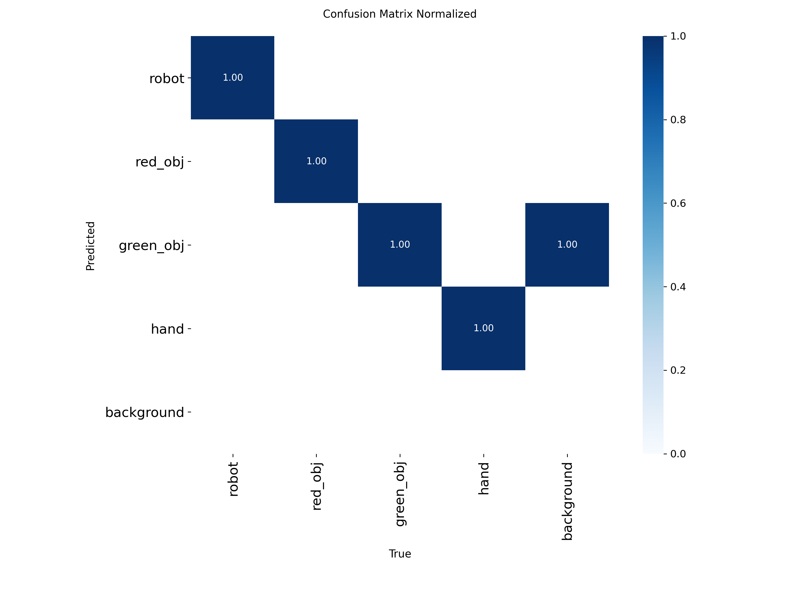
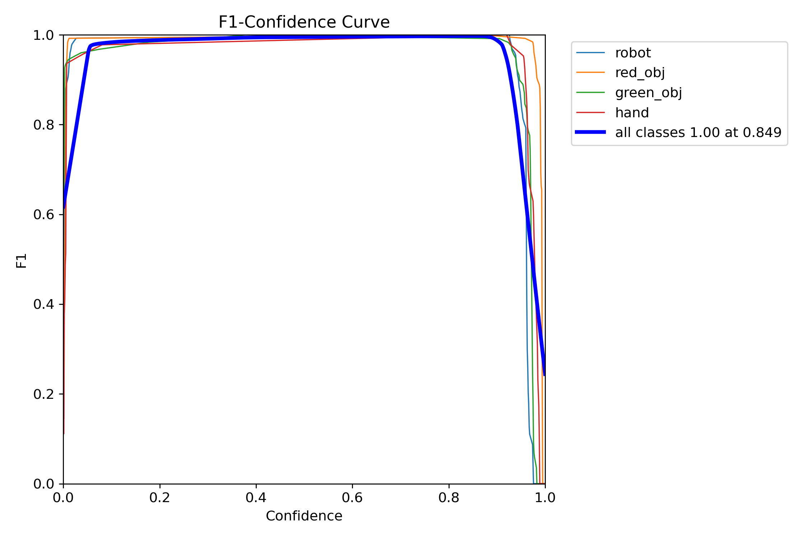

# Industrial Kitting & Safety Analysis (YOLOv8-Segmentation)

This project is a state-of-the-art computer vision system designed to ensure **Human-Robot Collaboration (HRC)** safety in industrial manufacturing environments and to automate **kitting** assembly steps.

The system utilizes the **YOLOv8-Segmentation (YOLOv8n-seg)** architecture to perform real-time object detection and instance segmentation. It monitors custom-defined static industrial safety zones (Warning Zone, Danger Zone) and a material tray (Kitting Tray) to generate instantaneous system states and safety-critical decisions.

---

## Project Overview & Core Features

* **YOLOv8-Segmentation Integration:** High-precision, pixel-level detection and segmentation of 4 main classes: `robot`, `red_obj` (red part), `green_obj` (green part), and `hand` (operator's hand).
* **Industrial Hardware Compatibility:** Seamless live integration with **Basler Industrial Cameras** via the Pylon API (`pypylon`) and OpenCV.
* **Intelligent Zone-Based Analysis:**
  **WARNING ZONE:** Triggers an orange warning state on the HUD when the operator's hand crosses the outer security perimeter.
  **DANGER ZONE:** Triggers a red critical alarm immediately when the operator's hand enters the active workspace/robot cell (ideal for automated emergency stop integration).
  **KITTING TRAY:** Monitors coordinates of the red (`red_obj`) and green (`green_obj`) assembly parts using a Finite State Machine (FSM) to track the kitting process (`KIT_EMPTY`, `KIT_PARTIAL`, `KIT_COMPLETED`).
* **Industrial HUD Dashboard:** A sleek, semi-transparent Head-Up Display (HUD) overlay providing real-time system feedback (`SAFETY` and `KITTING` states) and high-resolution millisecond timestamps.
* **Data Pipeline & Formatting:** An automated pipeline that converts multi-polygon annotations from **Labelme JSON** format to normalized YOLOv8-Segmentation text coordinates, splitting the data pool into 85% training and 15% validation.

---

## Training Performance & Results


The **YOLOv8n-seg** model was trained for 50 epochs on an Intel Core i7-14700HX CPU. The evaluation metrics demonstrate exceptional stability and accuracy:

* **Total Dataset Size:** 377 raw images and JSON annotations (`data_pool`), generating 67 validation images with 213 distinct instances.
* **Overall Model Accuracy (mAP50):** * **Bounding Box (Box mAP50):** `0.995` (99.5%)
  * **Instance Segmentation (Mask mAP50):** `0.995` (99.5%)

### Class-Specific Validation Metrics:

| Class | Instances | Box Precision (P) | Box Recall (R) | Box mAP50 | Mask Precision (P) | Mask Recall (R) | Mask mAP50 |
| :--- | :---: | :---: | :---: | :---: | :---: | :---: | :---: |
| **All Classes** | 213 | 0.999 | 0.996 | 0.995 | 0.999 | 0.996 | 0.995 |
| **robot** | 67 | 0.999 | 1.000 | 0.995 | 0.999 | 1.000 | 0.995 |
| **red_obj** | 64 | 1.000 | 1.000 | 0.995 | 1.000 | 1.000 | 0.995 |
| **green_obj** | 60 | 1.000 | 0.985 | 0.995 | 1.000 | 0.985 | 0.995 |
| **hand** | 22 | 0.996 | 1.000 | 0.995 | 0.996 | 1.000 | 0.995 |

* **Average Inference Speed:** ~46.4 ms / frame (on CPU).

### Model Evaluation Figures
To verify the metrics, the following training charts generated inside `YOLO_My_Model_1/` are referenced below:

| Confusion Matrix | F1 Curve (Mask) |
| :---: | :---: |
|  |  |

---

## Directory Tree & File Structure

```bash
├── data_pool/                      # Raw pool of 377 images and their respective Labelme JSON label files
├── yolo_dataset/                   # Train/Val dataset directory auto-generated by Yolo.py
│   ├── train/
│   │   ├── images/
│   │   └── labels/
│   └── val/
│       ├── images/
│       └── labels/
│   └── dataset.yaml
├── YOLO_My_Model_1/                # Output directory of model training run containing weights and plots
│   ├── weights/
│   │   └── best.pt                 # The trained best-performing weights for your custom model
│   ├── confusion_matrix.png
│   ├── results.png
│   └── ...                         # Validation and curve plots
├── Yolo.py                         # Parses Labelme JSON annotations and auto-formats to YOLOv8-Seg format
├── train model.py                  # Standard training script for YOLOv8-seg (runs 50 epochs)
├── camera.py                       # Core real-time script for industrial Basler camera streaming with HUD overlay
├── camera_test.py                  # Quick testing script utilizing a standard webcam with class filters
├── video_test.py                   # Processes offline video recordings with fast-forward frame skipping and HUD
├── 90second_sample video.py        # Utility script to record a raw 90-second MP4 video using a Basler camera
└── README.md                       # Documentation file
```
Prerequisites:
Make sure you have Python 3.10+ installed along with the following packages:

Bash:
pip install ultralytics opencv-python numpy pypylon
(Note: If you plan to use a Basler Camera, make sure the Pylon Camera Software Suite is installed on your operating system.)

Execution Guide:

1. Dataset Generation and Format Conversion
Put your annotated files inside data_pool/ and run the formatting pipeline:

Bash:
python Yolo.py

2. Model Training
Train the segmentation model locally on your dataset:

Bash:
python "train model.py"

3. Standard Webcam Testing
To test class detection quickly on a native webcam (without Basler hardware):

Bash:
python camera_test.py

4. Live Industrial Deployment (Basler Camera)
Execute real-time zone monitoring with your trained weights and Basler setup:

Bash:
python camera.py

5. Offline Video Processing
To run analytics with an accelerated frame skip (e.g. processing every 4th frame) on a pre-recorded raw video file:

Bash:
python video_test.py

Demo & HUD Logic:
When running, the system overlays segmented instance masks and color-codes static zones based on real-time intrusion flags:

SAFETY STATE:
SAFETY_OK (Green HUD Border): Work area is secure. Operator's hand is outside perimeter bounds.

WARNING (Orange HUD Border): Operator's hand enters the WARNING_ZONE.

DANGER (Red HUD Border): Operator's hand breaches the DANGER_ZONE. Initiates immediate safety-critical alarms.

KITTING STATE:
KIT_EMPTY: No objects inside the material tray boundaries.

KIT_PARTIAL: Only a red object or only a green object is within the kitting tray.

KIT_COMPLETED: Both red and green target objects are securely verified inside the tray bounds (Assembly task successful).

Developed by: Eray Aydemir - Mechatronics Engineer & Robotics and Automation M.Sc. Student
